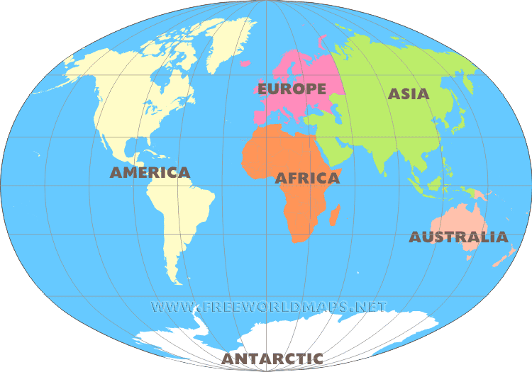

# web-technology-lab
# Image mapping in HTML5
Code for image mapping map 1
#<!Doctype HTML>
#<html>
#<head>
#<title></title>
#</head>
#<body>
#
#<map name="Map" id="Map">
 #   <area alt="" title="" href="antartica.html" shape="rect" coords="217,456,557,494" />
  #  <area alt="" title="" href="africa.html" shape="rect" coords="366,188,445,316" />
   # <area alt="" title="" href="australia.html" shape="rect" coords="624,298,675,347" />
    #<area alt="" title="" href="america.html" shape="rect" coords="132,73,309,397" />
    #<area alt="" title="" href="asia.html" shape="rect" coords="478,60,653,242" />
    #<area alt="" title="" href="europe.html" shape="rect" coords="381,77,469,156" />
#</map>
#</body>
#</html>
-->

Code for each continents
<!--
<!DOCTYPE html>
<html>
<head>
	<title>"Continent Name"</title>
</head>
<body>

</body>
</html>
-->
